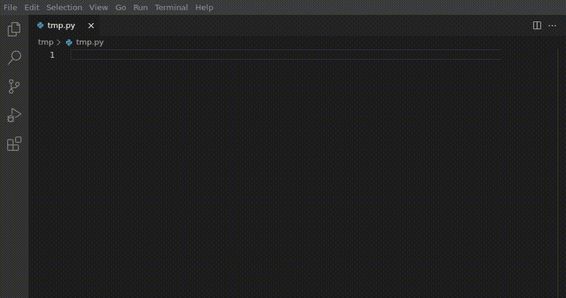

# copilot at home
This is a fork of the CodeGenX open source plugin, with a simple backend implemented for personal use.

## Installation
There are no packages.

To experimentally run this plugin, you can 

0. install and run the [backend](/backend)
1. open this repository in VSCode, run `npm i --ci`, and press F5.

## About
This project was created in less than 6 hours and has almost zero features at the moment.

Current short-term goals:

0. fix obvious bugs (context length, failure to redo completion request)
1. configuration options (inference config, multiple completion options, model choice)
2. copilot-like tab-completion
3. reduce hardware requirements (e.g. lower RAM spike, lower vram with LLM.int8, use accelerate and other speedups)

### Languages Supported
The default model is fine-tuned on Python code. Details on how to change this can be found in [here](/backend)

## Acknowledgements

This project exists because DeepGenX open-sourced their extension.
